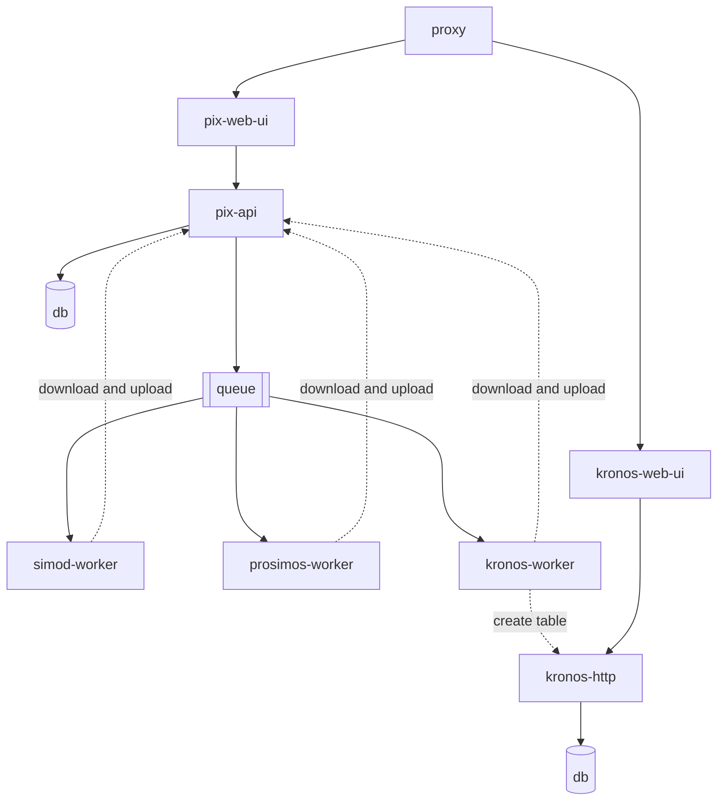

# PIX Portal

The project is a suite of applications that provide a single point of entry for users to access the various services provided by the PIX platform:

- Business process simulation model discovery
- Simulation
- Waiting time analysis

## Architecture

