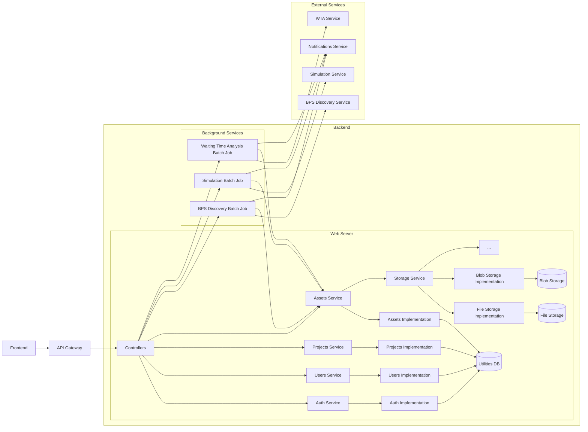
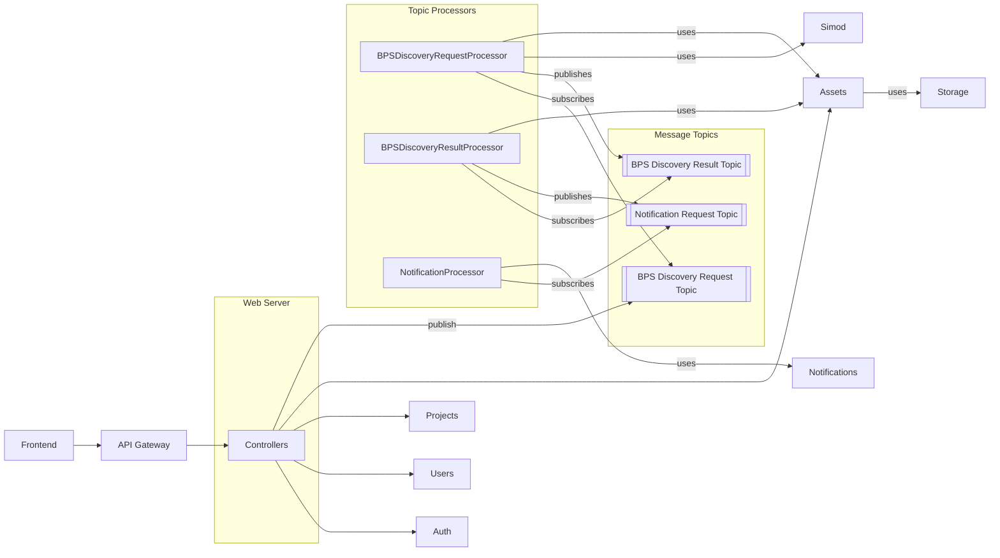
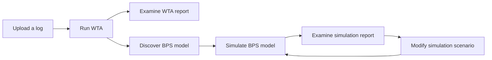
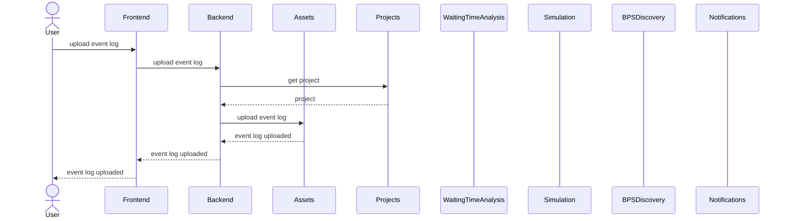
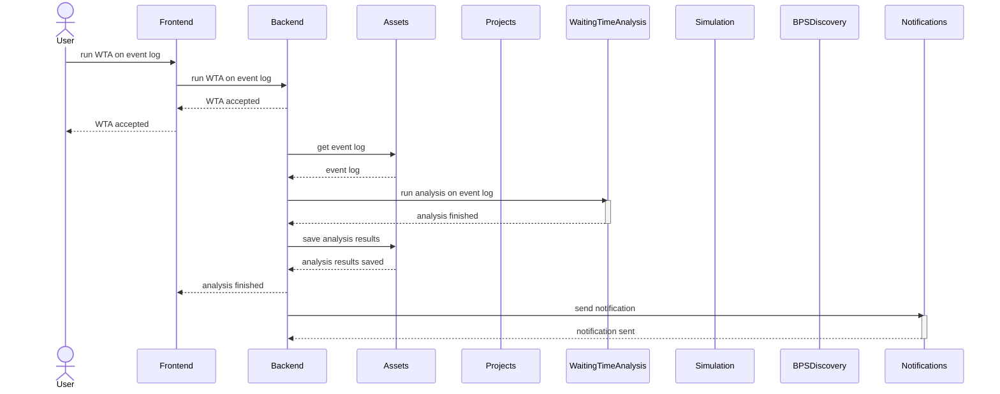

# Back-End

## Architecture

### Hybrid approach

Monolithical web server with background jobs and external services:

### Event-driven approach using microservices

- Control the number of concurrently running batch processes
- Distribute batch processes across multiple machines (e.g., BPS discovery on several machines, simulation on several machines, etc.)
- Should each processor call an external service or should it use the underlying tool directly?

## Waiting Time Analysis

### Workflow

### File upload sequence diagram

### Analysis sequence diagram

